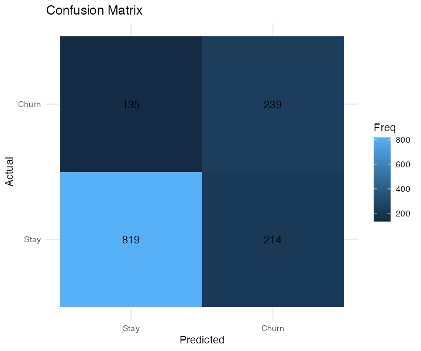
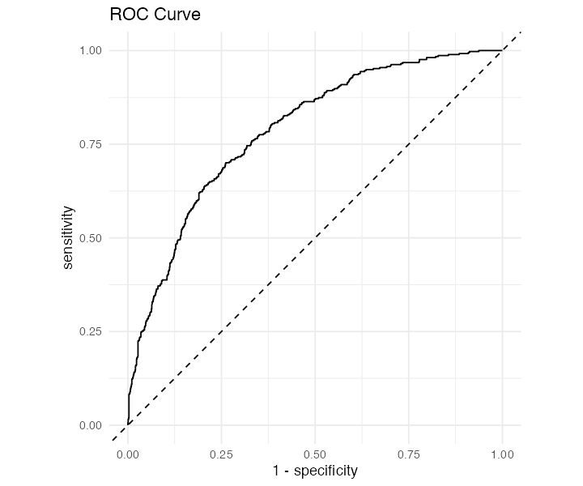

# Gradient Boosting Churn Model Report

**Test ROC AUC:** 0.7872  
**Test F1 (@thr=0.31):** 0.578

## Classification Report

# A tibble: 3 × 2
  metric    value
  <chr>     <dbl>
1 precision 0.528
2 recall    0.639
3 f1        0.578

  

